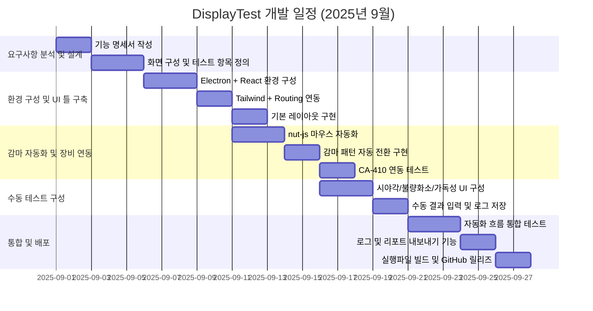

# 🎯 DisplayTest

> **Electron 기반 디스플레이 시각 품질 검사 자동화 시스템**

**DisplayTest**는 고급 디스플레이 품질 검사를 위해 설계된 Electron 기반 데스크탑 애플리케이션입니다.  
멀티스크린 제어, CA-410 연동, nut-js 기반 마우스 자동화를 통해 수동 및 자동 테스트를 통합하며, 감마, 명암비, 시야각, 불량 화소 등 다양한 항목의 시각 테스트를 정밀하게 수행할 수 있습니다.

---

## 📸 기능 요약

- ✅ **자동 감마 테스트** (패턴 순차 출력 + CA-410 측정 자동화)
- ✅ **멀티스크린 제어** (화면 위치 지정, 자동 창 이동)
- ✅ **nut-js 마우스 자동화** (CA-410 클릭, 측정 동작 트리거)
- ✅ **수동 시각 테스트 항목 구성** (시야각, 불량 화소 등)
- ✅ **결과 저장 및 로그 기록** (CSV / JSON 내보내기 지원)
- ✅ **React 기반 모듈형 UI** (Tailwind로 스타일 구성)

---

## 📦 기술 스택

| 분류       | 사용 기술                                  |
|------------|---------------------------------------------|
| 플랫폼     | Electron, React, Tailwind CSS               |
| 자동화     | nut-js, screen.js                           |
| 측정 장비  | CA-410 (콘카 컬러/휘도 측정기)              |
| UI 프레임워크 | Electron Forge, Webpack, React Router     |
| 데이터 처리 | JSON, CSV 파일 저장, 자동 경로 지정         |

---

## 🧪 테스트 항목 구성

| 항목         | 방식     | 설명                                                  |
|--------------|----------|-------------------------------------------------------|
| 감마         | 자동     | Gray Level 순차 출력 + CA-410 측정 자동 트리거        |
| 명암비       | 수동     | 화이트/블랙 전환 → 휘도 수동 측정                     |
| 시야각       | 수동     | 원형 가이드 제공 → 육안 판단                         |
| 불량 화소    | 수동     | R/G/B/W/B 패턴 순환 확인                             |
| 밝기 균일도  | 수동     | 9포인트 위치 가이드 제공                             |
| 색상 정확도  | 수동     | 기준 색상 대비 CA-410 수동 측정                      |
| 멍/한지/그레인 | 수동   | 다양한 무늬 및 배경 패턴 제공 → 육안 판단            |
| 빛샘         | 수동     | Black 화면으로 확인                                  |
| 가독성       | 수동     | 텍스트 패턴 제공 → 시인성 및 폰트 테스트             |

---

## 📁 프로젝트 구조
```code
DisplayTest/
├── src/
│ ├── main/ # Electron Main Process
│ ├── renderer/ # React UI
│ ├── screens/ # SubWindow 컴포넌트들
│ ├── automation/ # nut-js 마우스 자동화
│ ├── utils/ # 측정 결과 저장, 로그 등
├── tailwind.config.js
├── postcss.config.js
├── forge.config.js
├── package.json
└── README.md
```



